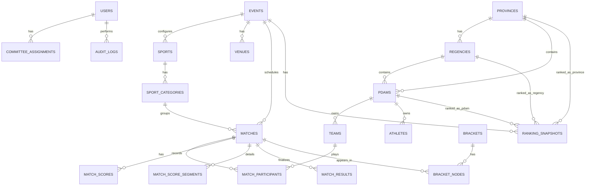

# ERD v1 Baseline

Addendum wajib: satu `province` memiliki satu `regional_committee`; setiap `event_entry` menyimpan `pdam_id`, `province_id`, dan `regional_committee_id`. Lihat [delegation-standard.md](./delegation-standard.md).

## Core Tables

## Catatan

- `MATCH_PARTICIPANTS` menjaga fleksibilitas peserta tim/individu.
- `MATCH_SCORE_SEGMENTS` menyimpan set, game, quarter, babak, ronde.
- `MATCH_RESULTS` menyimpan keputusan akhir, walkover, diskualifikasi, atau no contest.
- `BRACKET_NODES` mendukung knockout dan lower bracket lewat field `bracket_type`.
