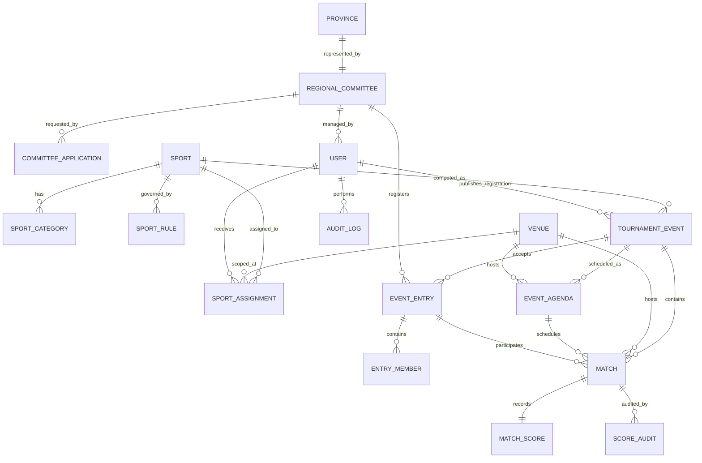

# ERD Konseptual Sport PERPAMSI

## Aturan Relasi

- Registrasi publik membuat `committee_applications`, bukan PD PERPAMSI baru.
- `event_entries` tidak bergantung pada PDAM, kabupaten/kota, atau kolom pemain tetap.
- Pemain disimpan pada `entry_members`.
- Peraturan cabor berversi; kompetisi menyimpan versi yang berlaku.
- Portal PD membaca `TournamentEvent` terpublikasi, bukan seluruh `SportCategory`.
- `TournamentEvent.registration_rules` menjadi snapshot regulasi setelah publish.
- `sport_categories.max_members` nullable; null berarti tidak ada maksimum yang dinyatakan panduan.
- Official tidak disimpan sebagai `entry_members`.
- Agenda terkait venue dan opsional kompetisi/cabor.
- Assignment cabor dan venue menjadi sumber scope panitia; scope match mengikuti jadwal venue pada fase operasional pertandingan.
- Master yang sudah direferensikan memakai restrict delete.
- Audit append-only.
- `EventAgenda 1—N EventAgendaAudit N—1 User` melacak revisi dan publikasi jadwal.

## Constraint Kritis

- Satu PD PERPAMSI per provinsi.
- Satu pengajuan aktif per provinsi.
- Satu registrasi PD per kompetisi kecuali kategori mengizinkan multi-entry.
- Kompetisi default draft dan tidak menerima registrasi sebelum dipublikasikan Admin.
- Tidak ada bentrok venue/waktu.
- Tidak ada bracket lock dengan verifikasi belum selesai.
- Tidak ada write panitia di luar assignment.

Struktur migration dan urutan transisi mengikuti [migration-plan.md](./migration-plan.md).
