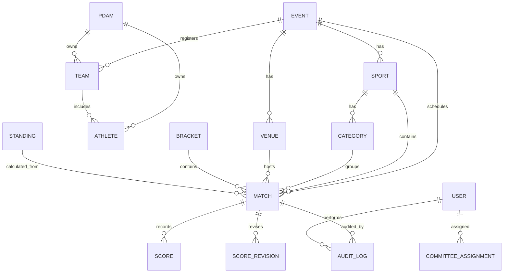

# ERD Konseptual Sport PERPAMSI

## Relasi Utama

## Catatan v1

- ERD ini konseptual, bukan migration final.
- `MatchParticipant` bisa dipakai bila peserta match tidak selalu team, misalnya individu.
- `Standing` dan `RankingSnapshot` boleh dihitung ulang dari match final.
- `AuditLog` wajib append-only.
