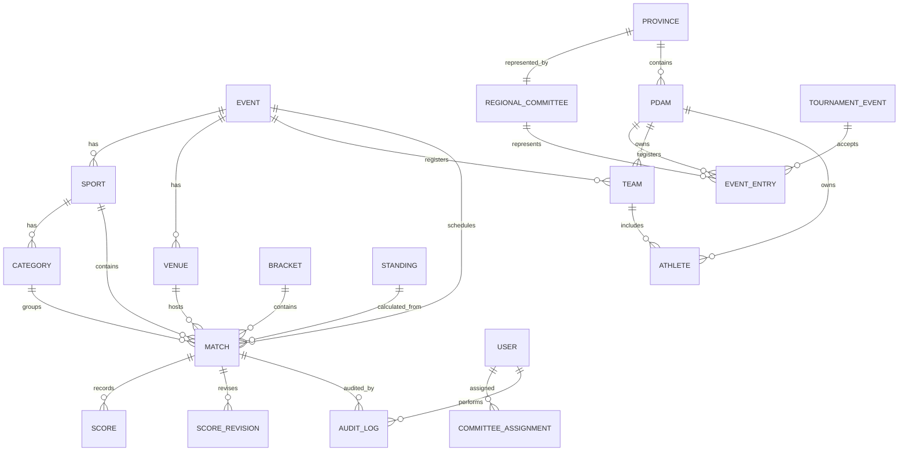

# ERD Konseptual Sport PERPAMSI

## Relasi Utama



## Catatan v1

- ERD ini konseptual, bukan migration final.
- `MatchParticipant` bisa dipakai bila peserta match tidak selalu team, misalnya individu.
- `Standing` dan `RankingSnapshot` boleh dihitung ulang dari match final.
- `EventEntry` menghubungkan peserta pertandingan dengan PDAM dan Kontingen Provinsi.
- Klasemen medali memakai provinsi; match dan bracket menampilkan nama provinsi, sedangkan PDAM hanya metadata asal internal.
- `AuditLog` wajib append-only.

## Addendum v2: Struktur Cabor, Kategori, Bracket, dan Skor

Relasi utama yang harus disiapkan sejak awal:

```text
sports
  └─ sport_categories nullable per cabor
      └─ tournament_events
          ├─ event_entries
          ├─ matches
          │   ├─ match_scores
          │   └─ score_audits
          ├─ bracket_nodes
          └─ standings / ranking_snapshots

provinces
  ├─ regional_committees
  └─ pdams
       └─ event_entries ── regional_committees
```

### Entity Tambahan

#### sport_categories

- `id` internal bigint.
- `public_id` UUID untuk public/API.
- `sport_id` relasi ke `sports`.
- `code` unik per cabor.
- `name` contoh `Ganda Campuran`.
- `competition_type`: `individual`, `doubles`, `team`, `ranking`.
- `scoring_type`: `goals`, `set_points`, `games_points`, `strokes`, `judge_score`, `match_points`.
- `is_active` boolean.

#### tournament_events

- Satu record mewakili satu kompetisi spesifik.
- Contoh: `Bulu Tangkis - Ganda Campuran`, `Catur`, `Golf Individual`.
- `sport_category_id` nullable.
- `format`: `knockout`, `group_then_knockout`, `round_robin`, `swiss`, `ranking`.
- `status`: `draft`, `registration_open`, `registration_closed`, `bracket_locked`, `running`, `completed`.
- `bracket_size` nullable untuk format non-bracket.

#### event_entries

- Peserta dalam tournament_event.
- Untuk tunggal: `athlete_1_id` terisi.
- Untuk ganda: `athlete_1_id` dan `athlete_2_id` terisi.
- Untuk beregu: `team_id` terisi.
- Untuk PDAM-only demo: `pdam_id` cukup.
- Simpan `seed_no`, `province_id`, `regency_id` untuk seeding dan filter.

#### matches

- `tournament_event_id` wajib.
- `round_no`, `round_name`, `side`, `slot_no`.
- `entry_a_id`, `entry_b_id`, `winner_entry_id`.
- `next_match_id`, `next_slot` untuk bracket progression.
- `status`: `scheduled`, `live`, `final`, `verified`, `disputed`.
- `score_summary` untuk public cepat.

#### match_scores

- `match_id`.
- `score_payload` JSONB untuk detail skor per cabor.
- `calculated_winner_entry_id`.
- `verified_by`, `verified_at`.

#### score_audits

- `match_id`, `before_json`, `after_json`, `user_id`, `reason`, `created_at`.
- Wajib untuk koreksi skor dan perubahan winner.

### Index Minimum

- `sport_categories (sport_id, is_active)`.
- `tournament_events (sport_id, sport_category_id, status)`.
- `event_entries (tournament_event_id, pdam_id)`.
- `event_entries (tournament_event_id, seed_no)`.
- `matches (tournament_event_id, round_no, side, slot_no)`.
- `matches (tournament_event_id, status)`.
- `matches (next_match_id)`.
- `pdams (province_id, regency_id)`.
- Full text/trigram index untuk pencarian instansi asal pada portal internal bila tersedia.
