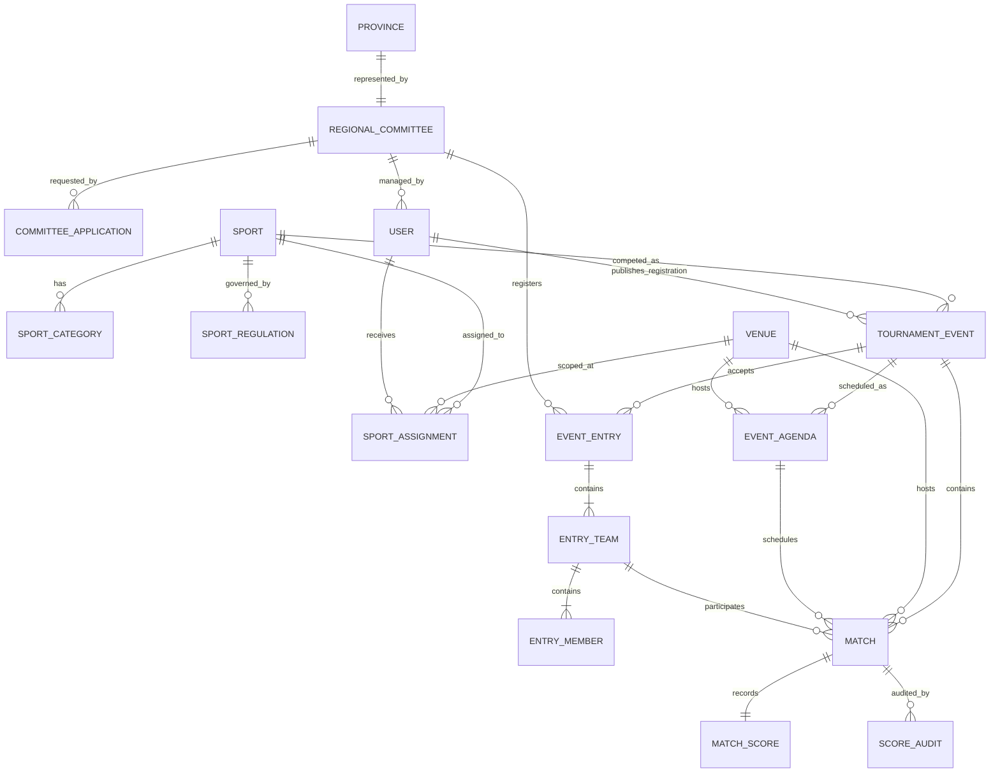

# ERD Konseptual Sport PERPAMSI — Kondisi Nyata

Diagram ini menggambarkan relasi nyata yang tersedia pada migration aktif. Entity target yang belum memiliki tabel dicatat setelah diagram dan tidak dicampur sebagai relasi aktif.

```mermaid
erDiagram
    PROVINCE ||--|| REGIONAL_COMMITTEE : represented_by
    REGIONAL_COMMITTEE ||--o{ COMMITTEE_APPLICATION : requested_by
    REGIONAL_COMMITTEE ||--o{ USER : managed_by
    SPORT ||--o{ SPORT_CATEGORY : has
    SPORT ||--o{ SPORT_REGULATION : governed_by
    SPORT ||--o{ TOURNAMENT_EVENT : competed_as
    USER ||--o{ TOURNAMENT_EVENT : publishes_registration
    SPORT ||--o{ SPORT_ASSIGNMENT : assigned_to
    VENUE ||--o{ SPORT_ASSIGNMENT : scoped_at
    USER ||--o{ SPORT_ASSIGNMENT : receives
    TOURNAMENT_EVENT ||--o{ EVENT_ENTRY : accepts
    REGIONAL_COMMITTEE ||--o{ EVENT_ENTRY : registers
    EVENT_ENTRY ||--|{ ENTRY_TEAM : contains
    ENTRY_TEAM ||--|{ ENTRY_MEMBER : contains
    TOURNAMENT_EVENT ||--o{ EVENT_AGENDA : scheduled_as
    VENUE ||--o{ EVENT_AGENDA : hosts
    TOURNAMENT_EVENT ||--o{ MATCH : contains
VENUE ||--o{ MATCH : hosts
EVENT_AGENDA ||--o{ MATCH : schedules
    ENTRY_TEAM ||--o{ MATCH : participates
    MATCH ||--|| MATCH_SCORE : records
    MATCH ||--o{ SCORE_AUDIT : audited_by
```

Audit nyata tidak memakai satu tabel `AUDIT_LOG`. Sistem memakai tabel audit per entity: `committee_application_audits`, `entry_registration_audits`, `entry_team_audits`, `entry_member_audits`, `event_publication_audits`, `event_agenda_audits`, `sport_assignment_audits`, `master_data_audits`, dan `score_audits`.

**TARGET — belum ada tabel aktif:** SeedingSnapshot, Bracket terpisah, Standing, MedalRanking, PublishedView, AuditLog generik, ExportJob, dan ReportSnapshot.

## Aturan Relasi

- Registrasi publik membuat `committee_applications`, bukan PD PERPAMSI baru.
- `event_entries` tidak bergantung pada PDAM, kabupaten/kota, atau kolom pemain tetap; izin satu kali penambahan team disimpan pada `team_addition_opened_at`. Submit team tambahan mengembalikan parent verified ke pending tanpa membuka team lama.
- `EventEntry` adalah parent registrasi; `EntryTeam` adalah unit peserta kompetisi; pemain disimpan pada `entry_members` milik team.
- Nama team dibentuk server sebagai `PD PERPAMSI {provinsi} #{team_no}` sesuai [standar multi-team](./team-entry-standard.md).
- Peraturan cabor berversi; kompetisi menyimpan versi yang berlaku.
- Portal PD membaca `TournamentEvent` terpublikasi, bukan seluruh `SportCategory`.
- `TournamentEvent.registration_rules` menjadi snapshot regulasi setelah publish.
- `sport_categories.max_members` nullable; null berarti tidak ada maksimum yang dinyatakan panduan.
- Official tidak disimpan sebagai `entry_members`.
- Agenda terkait venue dan opsional kompetisi/cabor.
- Assignment cabor dan venue menjadi sumber scope panitia; scope match mengikuti jadwal venue pada fase operasional pertandingan.
- Master yang sudah direferensikan memakai restrict delete.
- Pengecualian cleanup 22 Juli 2026: kategori nonaktif beserta seluruh graph kompetisi turunannya dihapus untuk mempersempit scope ke kategori resmi aktif.
- Audit append-only.
- `EventAgenda 1—N EventAgendaAudit N—1 User` melacak revisi dan publikasi jadwal.

## Constraint Kritis

- Satu PD PERPAMSI per provinsi.
- Satu pengajuan aktif per provinsi.
- Satu parent registrasi aktif per PD/kompetisi; jumlah `EntryTeam` mengikuti snapshot `max_teams_per_pd`.
- Unique `(event_entry_id, team_no)`; nomor team positif dan immutable setelah submit.
- Setiap anggota dimiliki tepat satu team dan tidak dapat dipindahkan antar-team setelah verified.
- Kompetisi default draft dan tidak menerima registrasi sebelum dipublikasikan Admin.
- Tidak ada bentrok venue/waktu.
- Tidak ada bracket lock bila team aktif belum efektif verified.
- Tidak ada write panitia di luar assignment.

Struktur migration dan urutan transisi mengikuti [migration-plan.md](./migration-plan.md).
